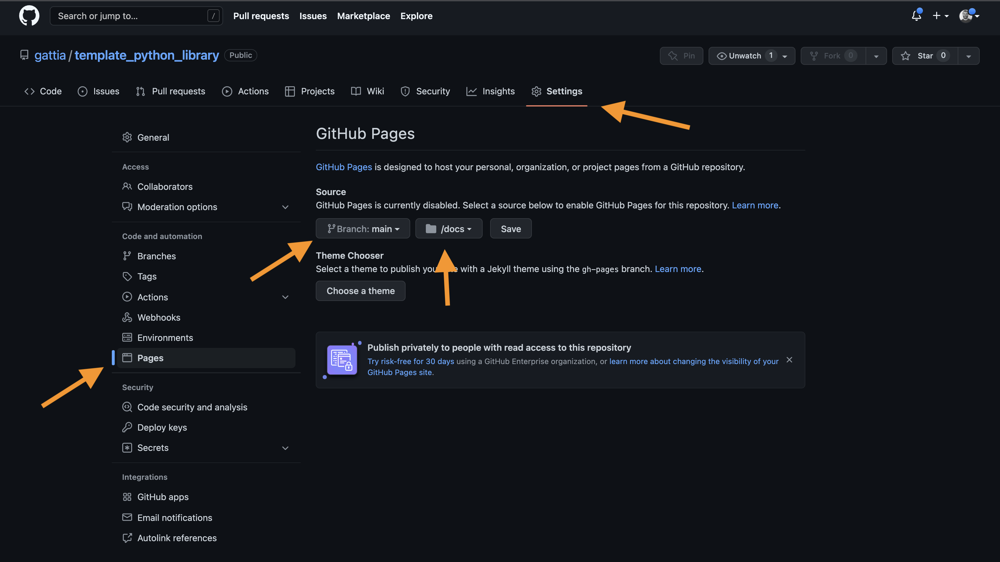

<br>
<br>
|[Documentation](http://anthonygattiphd.com/template_python_library/)|


# Introduction
{update_here}
This package is an example/template for building repositories. The choices made
in this repository are based on a combination of experience, convenience, and current
convention. These factors will change over time, and as such so will/should the 
recommendations made in this document. 

This package works like a normal package, it can be installed, tests can be run,
it can be linted, coverage will be calculated, it should even push to pypi on push
to master (merge accepted). 

In the following, we briefly provide information about the format of this repository, 
this is followed by the boilerplate `README.md` sections that describe how to install,
how to run examples, how to run tests, how to get coverage, how to lint, etc. 

Throughout this file, and the other files in this template, replace `{my_pacakge}`
with the name of the new repository that you are creating. Also, replace 
`{template_python_library}`

#### To do:
- [] give coverage badge on `README.md`
- [] setup automatic push to pypi
    - [] setup pypi account
    - [] add token for pypi to repo

## Structure 
Here is the general structure of this setup. Below this structure are quick instructions of 
things to change for your new repository. 

Instructions on `Packaging` from python are provided here: 
- https://packaging.python.org/en/latest/tutorials/packaging-projects/

```
my_package/
    my_package/ 
        __init__.py
        files.py
        modules/
            __init__.py
            more_files.py
    
    .github/
        ISSUE_TEMPLATE/
            bug_report.md # template for filing bugs
            feature_request.md # template for feature requests
        workflows/
            build-test.yml 
                # github actions workflow to:
                #   - test linting/formating
                #   - build & test the package
                # To work, this requires a number of the Make commands to 
                # be setup, including: dev, requirements, lint, test
    
    docs/
        # folder where the docs will be built
    
    examples/ 
        # folder where example scripts should be placed. 
        # e.g., https://github.com/gattia/cycpd/tree/main/examples
    
    .gitignore
        # pre-filled gitignore file for common python packages
    
    Makefile
        # makefile with convenienience commands designed to make 
        # developing/installing easy. 
    
    pyproject.toml
        # file to specif

    README.md 
        # current background info, install info, and how to contribute

    setup.py 
        # file to call to build library `python setup.py install`
        # setup.py is no longer encouraged. We provide the most basic one here
        # this can be used to install in editable mode.
        # https://setuptools.pypa.io/en/latest/userguide/quickstart.html#development-mode
        # this is only needed for editable mode because `pyproject.toml` not fully supported for 
        # editable mode (as described in link above). 
        #
        # also, the setup.py might be needed for installing cython dependencies
        # Example here: https://github.com/gattia/cycpd/blob/e235da5276652eea12875aef3c8280a9b673122e/setup.py#L12-L20
        # and here: https://github.com/gattia/cycpd/blob/e235da5276652eea12875aef3c8280a9b673122e/setup.py#L48

    pyproject.toml 
        # provides other info for setup.py, and other tools (e.g., linting)
        # information for setting up `pyproject.toml`: https://peps.python.org/pep-0621/
        # other helpful resources: 
        #    https://setuptools.pypa.io/en/latest/userguide/pyproject_config.html
        #    https://scikit-hep.org/developer/pep621
    
    requirements.txt
        # packages that this repository requires/ that should be installed first 
        # this is necessary to let conda install dependencies (as well as pip). 

    CONTRIBUTING.md 
        # information about how to contribte to the library
    
    LICENSE
        # Package license / license type. 
```

Steps to update this package for new repository: 
1. `find` all instances of "{my_project}" and replace with package name
    - Also replace all `{template_python_library}`
2. rename my_package, and the name of this folder to be the correct names. 
3. fill in the `"description"` in the `pyproject.toml`
4. update `requirements.txt` as well as `dependencies` in `pyproject.toml`
5. Search the repositry for `{update_here}` to find instances that should be updated for 
    the new package being built. 
6. After pushing to new repository on github, make sure to change the setting to include
    github pages, and direct them to look in the branch=main, /docs folder 
7. If there is a problem finding the package structure, then you can specify package information: 
    https://setuptools.pypa.io/en/latest/userguide/pyproject_config.html#dynamic-metadata
    This describes a system similar to defining `packages=['pymskt', 'pymskt.image', etc.]` in `setup()`

# Installation

You should be able to install this by cloning, navigating to this root directory, and installing with pip:

```
git clone https://github.com/gattia/template_python_library
cd template_python_library

conda create -n template_python_library python=3.8

pip install .
```

# Examples

Describe how to use the examples. E.g., {update_here}

Navigate to the examples directory and run the scripts: 
```bash
cd examples
python examples/example_1.py
```

# Development / Contributing

## Tests
The test can be run by: 

```bash
pytest
```

or 
```bash
make test
```

Inidividual tests can be run by running 

```
python -m pytests path_to_test
```

## Coverage
- Coverage results/info requires `coverage` (`conda install coverage` or `pip install coverage`)
- These should be installed automatically with one of the  `make dev` commands.
- You can get coverage statistics by running: 
    - `coverage run -m pytest`
    or if using make: 
    - `make coverage`
        - This will save an html of the coverage results. 

### note about coverage:
    - Coverage runs by seeing how much of the code-base is covered when you run the command after coverage. 
    In this case, it is looking to see how much of the code-base is covered when we run the tests. 

## Contributing
If you want to contribute, please read over the documentaiton in `CONTRIBUTING.md`

## Docs
To build the docs, run `make docs`. If the docs are already built, you might need to delete
them before they can be rebuilts: `rm -rf /docs`, then `make docs`. You then just need to 
activate github pages in your settings on the repository, and select the home dir for the 
docs to `/docs` on the `main` branch. Like in the following:




# License
MIT License